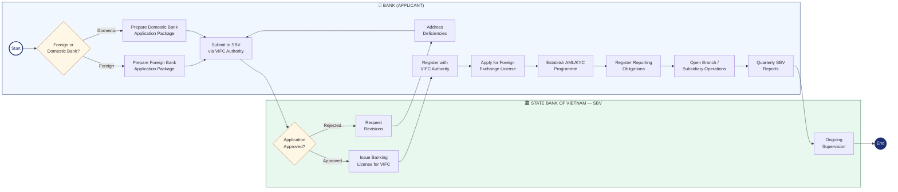

# BPMN — Bank Cooperation With VIFC

*Business Process Model and Notation (BPMN) diagram for banks (foreign and domestic) entering VIFC.*

## Process Diagram

## BPMN Element Key

| Symbol | Meaning |
|--------|---------|
| ○ Thin circle | Start Event |
| ● Thick circle | End Event |
| ▭ Rectangle | Task / Activity |
| [Diamond | Gateway (Decision) |
| Swimlane | Participant / Role |

## Process Steps

### Pool: Bank (Applicant)
1. **Gateway: Foreign or Domestic?** — Determines document requirements
2. **Prepare Application Package** — License, financials, fit & proper, compliance programme
3. **Submit to SBV via VIFC Authority**
4. **Address Deficiencies** — If SBV requests revisions
5. **Register with VIFC Authority** — After license issued
6. **Apply for Foreign Exchange License** — Decree 329
7. **Establish AML/KYC Programme**
8. **Register Reporting Obligations** — With SBV
9. **Open Branch / Subsidiary Operations**
10. **Submit Quarterly SBV Reports** — Ongoing

### Pool: State Bank of Vietnam (SBV)
1. **Review Application** — Gateway: approve or reject
2. **Request Revisions** — If rejected
3. **Issue Banking License for VIFC**
4. **Ongoing Supervision**

## Related Topics
- [[Decree 329 Banking And Foreign Exchange]]
- [[Foreign Banks In The Vietnam International Financial Centre]]
- [[Domestic Banks In The Vietnam International Financial Centre]]
- [[Aml And Compliance Summary For Investment Banks In Tttc]]
- [[Bpmn Foreign Company Cooperation With Vifc]]

---

## Detailed Process Information

# Process Map — How Banks Cooperate With VIFC

## Key Requirements for Banks

### Foreign Banks
- Valid banking license from home jurisdiction
- Minimum 3 years of profitable operation
- Minimum capital as specified under Decree 329
- Fit and proper assessment for all directors and key executives
- Demonstrated compliance programme (AML/CFT)

### Domestic Banks
- Existing SBV license
- Board resolution to establish VIFC presence
- Capital ring-fenced for VIFC operations
- Designated VIFC compliance officer

## Applicable Decrees
- [[Decree 329 Banking and Foreign Exchange]] — primary licensing decree
- [[Decree 324 Financial Policies of TTTC]] — tax incentives
- [[Decree 323 Establishment of TTTC]] — governance framework

## Related Topics
- [[Foreign Banks In The Vietnam International Financial Centre]]
- [[Domestic Banks In The Vietnam International Financial Centre]]
- [[Foreign Exchange Rules In The Vietnam International Financial Centre]]
- [[Aml And Compliance Summary For Investment Banks In Tttc]]
- [[Process Map How Foreign Companies Cooperate With Vifc]]

*Last updated: 2026-06-04*

## Update Log
- **2026-06-04**: Merged detailed process map content.
