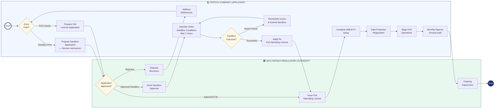

# BPMN — Fintech Company Cooperation With VIFC

*Business Process Model and Notation (BPMN) diagram for fintech companies entering VIFC.*

## Process Diagram

## BPMN Element Key

| Symbol | Meaning |
|--------|---------|
| ○ Thin circle | Start Event |
| ● Thick circle | End Event |
| ▭ Rectangle | Task / Activity |
| [Diamond | Gateway (Decision) |
| Swimlane | Participant / Role |

## Process Steps

### Pool: Fintech Company
1. **Gateway: Entry Path** — Regulatory sandbox or direct full license
2. **Prepare Application** — Sandbox: tech description, risk assessment, consumer protection plan, exit strategy
3. **Address Deficiencies** — If authority requests revisions
4. **Operate Under Sandbox** — Limited users, transaction caps, monthly reporting, max 2 years
5. **Gateway: Sandbox Outcome** — Successful or issues found
6. **Remediate and Extend** — If issues found during sandbox
7. **Apply for Full License** — After successful sandbox
8. **Complete AML/KYC Setup**
9. **Data Protection Registration**
10. **Begin Full Operations**
11. **Monthly Reports and Annual Audit** — Ongoing

### Pool: VIFC Fintech Regulatory Authority
1. **Review Application** — Gateway: approve or reject
2. **Request Revisions** — If rejected
3. **Grant Sandbox Approval** or **Issue Full License**
4. **Ongoing Supervision**

## Related Topics
- [[Co Che Thu Nghiem Co Kiem Soat In The Context Of Tttc]]
- [[Special Legal Mechanisms In The Vietnam International Financial Centre]]
- [[Compliance Requirements In The Vietnam International Financial Centre]]
- [[Bpmn Foreign Company Cooperation With Vifc]]

---

## Detailed Process Information

# Process Map — How Fintech Companies Cooperate With VIFC

## Key Requirements

### Regulatory Sandbox Entry
- Innovative financial technology with clear use case
- Consumer protection and risk mitigation plan
- Technical documentation of the solution
- Exit/wind-down strategy
- Minimum capital as required

### Full License Requirements
- Completed sandbox (or equivalent overseas track record)
- Full AML/KYC compliance programme
- Data localisation compliance
- Cybersecurity assessment

## Applicable Decrees
- [[Special Legal Mechanisms In The Vietnam International Financial Centre]] — sandbox framework
- [[Decree 329 Banking And Foreign Exchange]] — payment fintech
- [[Decree 324 Financial Policies Of Tttc]] — tax incentives

## Related Topics
- [[Co Che Thu Nghiem Co Kiem Soat In The Context Of Tttc]]
- [[Compliance Requirements In The Vietnam International Financial Centre]]
- [[Process Map How Foreign Companies Cooperate With Vifc]]

*Last updated: 2026-06-04*

## Update Log
- **2026-06-04**: Merged detailed process map content.
