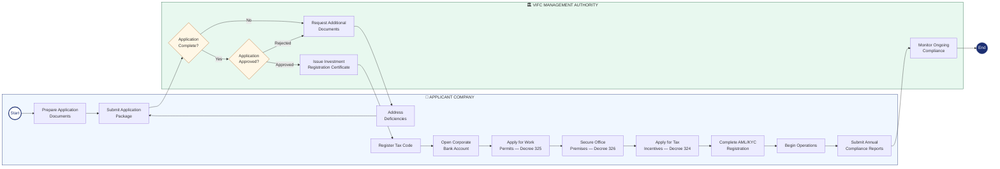

# BPMN — Foreign Company Cooperation With VIFC

*Business Process Model and Notation (BPMN) diagram for any foreign company entering VIFC.*

## Process Diagram

## BPMN Element Key

| Symbol | Meaning |
|--------|---------|
| ○ Thin circle | Start Event |
| ● Thick circle | End Event |
| ▭ Rectangle | Task / Activity |
| [Diamond | Gateway (Decision) |
| Swimlane | Participant / Role |

## Process Steps

### Pool: Applicant Company
1. **Prepare Application Documents** — Charter, financials, business plan, capital proof
2. **Submit Application Package** — To VIFC Management Authority
3. **Address Deficiencies** — If authority requests changes
4. **Register Tax Code** — With Vietnamese tax authority
5. **Open Corporate Bank Account** — In Vietnam
6. **Apply for Work Permits** — For foreign staff (Decree 325)
7. **Secure Office Premises** — Within VIFC zone (Decree 326)
8. **Apply for Tax Incentives** — Under Decree 324
9. **Complete AML/KYC Registration** — Under Decree 329
10. **Begin Operations**
11. **Submit Annual Compliance Reports**

### Pool: VIFC Management Authority
1. **Check Application Completeness** — Gateway: complete or incomplete
2. **Request Additional Documents** — If incomplete
3. **Review and Decide** — Gateway: approve or reject
4. **Issue Investment Registration Certificate**
5. **Monitor Ongoing Compliance**

## Related Topics
- [[Process Map How Foreign Companies Cooperate With Vifc]]
- [[Decree 323 Establishment Of Tttc]]
- [[Decree 324 Financial Policies Of Tttc]]
- [[Compliance Requirements In The Vietnam International Financial Centre]]

---

## Detailed Process Information

# Process Map — How Foreign Companies Cooperate With VIFC

This page maps the full process for any foreign company wishing to establish
operations or cooperate with the Vietnam International Financial Centre (VIFC/TTTC).

## Stage-by-Stage Description

### Stage 1 — Pre-Application
- Study applicable decrees: [[Decree 323 Establishment of TTTC]], [[Decree 324 Financial Policies of TTTC]]
- Identify which VIFC zone applies: Ho Chi Minh City or Da Nang
- Engage legal counsel familiar with Vietnamese corporate law

### Stage 2 — Document Preparation
Required documents:
- Certified copy of company charter / articles of incorporation
- Proof of legal existence in home country (apostilled)
- Audited financial statements (last 2 years)
- Business plan outlining VIFC activities
- Proof of minimum capital requirement
- Board resolution authorising VIFC establishment

### Stage 3 — Submission and Review
- Submit to VIFC Management Authority
- Review period: typically 15–30 working days
- Authority may request additional documents once

### Stage 4 — Registration and Setup
- Receive Investment Registration Certificate
- Register for tax code
- Open corporate bank account in Vietnam
- Apply for work permits for foreign staff (Decree 325)
- Secure office premises within VIFC zone (Decree 326)

### Stage 5 — Incentive Applications
- Apply for corporate income tax incentives (Decree 324)
- Apply for personal income tax incentives for key staff
- Register for special customs procedures if applicable (Decree 330)

### Stage 6 — Compliance Setup
- Complete AML/KYC registration (Decree 329)
- Establish internal compliance programme
- Register reporting obligations with supervisory authority

### Stage 7 — Ongoing Operations
- Annual compliance reports
- License renewal as required
- Update registration on material changes

## Key Decrees
| Decree | Covers |
|--------|--------|
| [[Decree 323 Establishment of TTTC]] | VIFC establishment, governance |
| [[Decree 324 Financial Policies of TTTC]] | Tax incentives, financial policies |
| [[Decree 325 Labor and Social Security in TTTC]] | Labor, work permits, social insurance |
| [[Decree 326 Land and Environment in TTTC]] | Land use, office premises |
| [[Decree 327 Immigration Policy]] | Visas, entry for foreign staff |
| [[Decree 329 Banking and Foreign Exchange]] | Banking licenses, FX, AML |
| [[Decree 330 Commodities Exchange in TTTC]] | Commodities trading |

## Cross-Reference for IFC Benchmarking
| Step | VIFC | Singapore MAS | Hong Kong SFC | Dubai DIFC |
|------|------|--------------|---------------|------------|
| Application review period | 15–30 days | 6–12 months | 3–6 months | 2–4 months |
| Minimum capital (general) | Per decree | SGD varies | HKD varies | USD varies |
| Tax rate | Per Decree 324 | 17% | 16.5% | 0% (DIFC) |
| Dispute resolution | [[Arbitration in the Vietnam International Financial Centre]] | SIAC | HKIAC | DIAC |

## Related Topics
- [[How Foreign Banks Can Work With VIFC Step By Step Onboarding Guide]]
- [[How Investment Banks Can Work With VIFC Step By Step Onboarding Guide]]
- [[How Import And Export Companies Can Work With VIFC Step By Step Onboarding Guide]]
- [[How Fintech Companies Can Work With VIFC Step By Step Onboarding Guide]]
- [[Tax Incentives In The Vietnam International Financial Centre]]
- [[Compliance Requirements In The Vietnam International Financial Centre]]
- [[Foreign Worker Regulations]]
- [[Vifc Onboarding Requirements Ifc Benchmarking And Cross-Reference Guide]]

*Last updated: 2026-06-04*

## Update Log
- **2026-06-04**: Merged detailed process map content.
