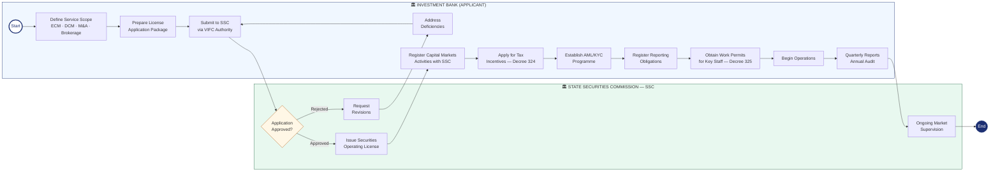

# BPMN — Investment Bank Cooperation With VIFC

*Business Process Model and Notation (BPMN) diagram for investment banks and securities firms entering VIFC.*

## Process Diagram

## BPMN Element Key

| Symbol | Meaning |
|--------|---------|
| ○ Thin circle | Start Event |
| ● Thick circle | End Event |
| ▭ Rectangle | Task / Activity |
| [Diamond | Gateway (Decision) |
| Swimlane | Participant / Role |

## Process Steps

### Pool: Investment Bank (Applicant)
1. **Define Service Scope** — ECM, DCM, M&A Advisory, Brokerage, Fund Management
2. **Prepare Application** — Home license, 3yr financials, fit & proper, compliance programme
3. **Submit to SSC via VIFC Authority**
4. **Address Deficiencies** — If SSC requests revisions
5. **Register Capital Markets Activities** — With SSC
6. **Apply for Tax Incentives** — Decree 324
7. **Establish AML/KYC Programme** — Decree 329
8. **Register Reporting Obligations**
9. **Obtain Work Permits for Key Staff** — Decree 325
10. **Begin Operations**
11. **Quarterly Reports and Annual Audit** — Ongoing

### Pool: State Securities Commission (SSC)
1. **Review Application** — Gateway: approve or reject
2. **Request Revisions** — If rejected
3. **Issue Securities Operating License**
4. **Ongoing Market Supervision**

## Related Topics
- [[Investment Banking Opportunities In The Vietnam International Financial Centre]]
- [[Securities Activities In The Vietnam International Financial Centre]]
- [[Decree 329 Banking And Foreign Exchange]]
- [[Bpmn Bank Cooperation With Vifc]]
- [[Bpmn Foreign Company Cooperation With Vifc]]

---

## Detailed Process Information

# Process Map — How Investment Banks Cooperate With VIFC

## Key Requirements

- Valid securities / investment banking license from home jurisdiction
- Minimum 3 years operating history
- Capital adequacy meeting VIFC requirements
- Fit and proper assessment for all licensed representatives
- Segregated client asset accounts
- Compliance officer designated for VIFC operations

## Services Permitted at VIFC
- Equity and debt capital markets underwriting
- Mergers and acquisitions advisory
- Securities brokerage and market making
- Fund structuring and management
- Derivatives and structured products (subject to approval)

## Applicable Decrees
- [[Decree 329 Banking And Foreign Exchange]] — securities and FX
- [[Decree 324 Financial Policies Of Tttc]] — tax incentives
- [[Decree 323 Establishment Of Tttc]] — governance
- [[Decree 325 Labor And Social Security In Tttc]] — key personnel

## Related Topics
- [[Investment Banking Opportunities In The Vietnam International Financial Centre]]
- [[Equity Capital Markets In The Vietnam International Financial Centre]]
- [[Debt Capital Markets In The Vietnam International Financial Centre]]
- [[Securities Activities In The Vietnam International Financial Centre]]
- [[Process Map How Foreign Companies Cooperate With Vifc]]

*Last updated: 2026-06-04*

## Update Log
- **2026-06-04**: Merged detailed process map content.
