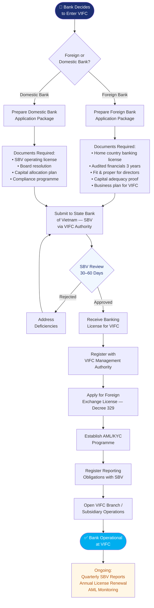

# Process Map — How Banks Cooperate With VIFC

## Banking Cooperation Flowchart

## Key Requirements for Banks

### Foreign Banks
- Valid banking license from home jurisdiction
- Minimum 3 years of profitable operation
- Minimum capital as specified under Decree 329
- Fit and proper assessment for all directors and key executives
- Demonstrated compliance programme (AML/CFT)

### Domestic Banks
- Existing SBV license
- Board resolution to establish VIFC presence
- Capital ring-fenced for VIFC operations
- Designated VIFC compliance officer

## Applicable Decrees
- [[Decree 329 Banking and Foreign Exchange]] — primary licensing decree
- [[Decree 324 Financial Policies of TTTC]] — tax incentives
- [[Decree 323 Establishment of TTTC]] — governance framework

## Related Topics
- [[Foreign Banks In The Vietnam International Financial Centre]]
- [[Domestic Banks In The Vietnam International Financial Centre]]
- [[Foreign Exchange Rules In The Vietnam International Financial Centre]]
- [[Aml And Compliance Summary For Investment Banks In Tttc]]
- [[Process Map How Foreign Companies Cooperate With Vifc]]

*Last updated: 2026-06-03*

## Update Log
- **2026-06-03**: Page created.
