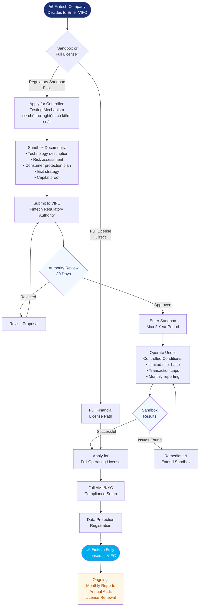

# Process Map — How Fintech Companies Cooperate With VIFC

## Fintech Cooperation Flowchart

## Key Requirements

### Regulatory Sandbox Entry
- Innovative financial technology with clear use case
- Consumer protection and risk mitigation plan
- Technical documentation of the solution
- Exit/wind-down strategy
- Minimum capital as required

### Full License Requirements
- Completed sandbox (or equivalent overseas track record)
- Full AML/KYC compliance programme
- Data localisation compliance
- Cybersecurity assessment

## Applicable Decrees
- [[Special Legal Mechanisms In The Vietnam International Financial Centre]] — sandbox framework
- [[Decree 329 Banking And Foreign Exchange]] — payment fintech
- [[Decree 324 Financial Policies Of Tttc]] — tax incentives

## Related Topics
- [[Co Che Thu Nghiem Co Kiem Soat In The Context Of Tttc]]
- [[Compliance Requirements In The Vietnam International Financial Centre]]
- [[Process Map How Foreign Companies Cooperate With Vifc]]

*Last updated: 2026-06-03*

## Update Log
- **2026-06-03**: Page created.
