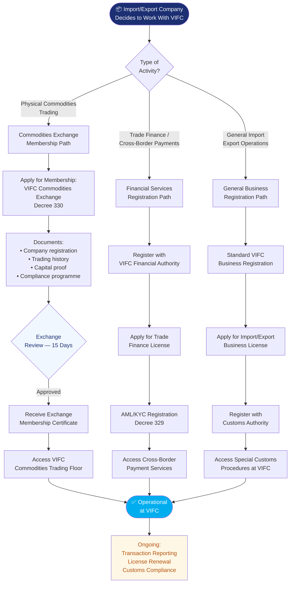

# Process Map — How Import and Export Companies Cooperate With VIFC

## Import / Export Cooperation Flowchart

## Key Requirements

### Commodities Exchange Members (Decree 330)
- Registered company in Vietnam or foreign branch
- Minimum capital as specified in Decree 330
- Designated compliance officer
- Trading system compatibility

### Trade Finance Operators
- Financial services license or banking partnership
- AML/KYC programme compliant with Decree 329
- Foreign exchange registration for cross-border transactions

### General Import/Export Companies
- Valid business registration certificate
- Import/export business license
- Customs registration with General Department of Vietnam Customs

## Applicable Decrees
- [[Decree 330 Commodities Exchange In Tttc]] — commodities trading
- [[Decree 329 Banking And Foreign Exchange]] — cross-border payments
- [[Decree 324 Financial Policies Of Tttc]] — tax incentives on trade
- [[Decree 326 Land And Environment In Tttc]] — warehousing and logistics zones

## Related Topics
- [[Cross Border Payments In The Vietnam International Financial Centre]]
- [[Financial Products And Instruments In The Vietnam International Financial Centre]]
- [[Tax Incentives In The Vietnam International Financial Centre]]
- [[Process Map How Foreign Companies Cooperate With Vifc]]

*Last updated: 2026-06-03*

## Update Log
- **2026-06-03**: Page created.
