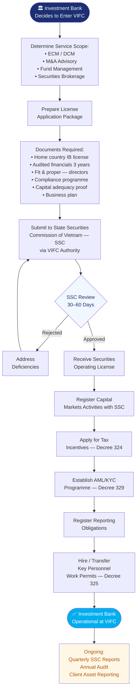

# Process Map — How Investment Banks Cooperate With VIFC

## Investment Banking Cooperation Flowchart

## Key Requirements

- Valid securities / investment banking license from home jurisdiction
- Minimum 3 years operating history
- Capital adequacy meeting VIFC requirements
- Fit and proper assessment for all licensed representatives
- Segregated client asset accounts
- Compliance officer designated for VIFC operations

## Services Permitted at VIFC
- Equity and debt capital markets underwriting
- Mergers and acquisitions advisory
- Securities brokerage and market making
- Fund structuring and management
- Derivatives and structured products (subject to approval)

## Applicable Decrees
- [[Decree 329 Banking And Foreign Exchange]] — securities and FX
- [[Decree 324 Financial Policies Of Tttc]] — tax incentives
- [[Decree 323 Establishment Of Tttc]] — governance
- [[Decree 325 Labor And Social Security In Tttc]] — key personnel

## Related Topics
- [[Investment Banking Opportunities In The Vietnam International Financial Centre]]
- [[Equity Capital Markets In The Vietnam International Financial Centre]]
- [[Debt Capital Markets In The Vietnam International Financial Centre]]
- [[Securities Activities In The Vietnam International Financial Centre]]
- [[Process Map How Foreign Companies Cooperate With Vifc]]

*Last updated: 2026-06-03*

## Update Log
- **2026-06-03**: Page created.
