# VIFC Cooperation Process — IFC Benchmarking Map

This page maps VIFC's cooperation process against other major international financial centres
for cross-reference and regulatory improvement purposes.

## High-Level Process Comparison

```mermaid
flowchart LR
    subgraph VIFC ["🇻🇳 VIFC (Vietnam)"]
        V1[Application
Submission] --> V2[Authority Review
15–60 Days]
        V2 --> V3[License
Issued]
        V3 --> V4[Tax Incentive
Application]
        V4 --> V5[AML/KYC
Setup]
        V5 --> V6[Operational]
    end

    subgraph SGP ["🇸🇬 MAS (Singapore)"]
        S1[Application
Submission] --> S2[MAS Review
6–12 Months]
        S2 --> S3[License
Issued]
        S3 --> S4[MAS Ongoing
Supervision]
        S4 --> S5[Operational]
    end

    subgraph HKG ["🇭🇰 SFC (Hong Kong)"]
        H1[Application
Submission] --> H2[SFC Review
3–6 Months]
        H2 --> H3[License
Issued]
        H3 --> H4[Ongoing
Reporting]
        H4 --> H5[Operational]
    end

    subgraph DIFC ["🇦🇪 DFSA (Dubai)"]
        D1[Application
Submission] --> D2[DFSA Review
2–4 Months]
        D2 --> D3[License
Issued]
        D3 --> D4[Ongoing
Supervision]
        D4 --> D5[Operational]
    end

    style VIFC fill:#e8f4fd,stroke:#1c2f72
    style SGP fill:#f0fff4,stroke:#276749
    style HKG fill:#fff5f5,stroke:#c53030
    style DIFC fill:#fffff0,stroke:#b7791f
```

## Detailed Benchmarking Table

| Criteria | VIFC 🇻🇳 | Singapore MAS 🇸🇬 | Hong Kong SFC 🇭🇰 | Dubai DIFC 🇦🇪 |
|----------|----------|------------------|------------------|----------------|
| **Review Period** | 15–60 days | 6–12 months | 3–6 months | 2–4 months |
| **Corporate Tax Rate** | Incentivised (Decree 324) | 17% | 16.5% | 0% (DIFC zone) |
| **Min. Capital (Bank)** | Per Decree 329 | SGD 1.5B+ | HKD 300M+ | USD 10M+ |
| **Foreign Ownership** | Per decree | 100% allowed | 100% allowed | 100% allowed |
| **Dispute Resolution** | Vietnamese courts / arbitration | SIAC | HKIAC | DIAC |
| **Regulatory Sandbox** | Available (Decree mechanism) | MAS Fintech Sandbox | HKMA Sandbox | DFSA Innovation Testing |
| **Language** | Vietnamese / English | English | English / Chinese | English |
| **AML Standard** | FATF-aligned | FATF | FATF | FATF |
| **Passporting** | ASEAN frameworks | ASEAN / global | ASEAN / global | Limited |

## Areas for VIFC Regulatory Improvement
*(To be completed by VIFC team based on benchmarking findings)*

- [ ] Review application timeline vs regional peers
- [ ] Assess capital requirements competitiveness
- [ ] Evaluate dispute resolution framework vs SIAC/HKIAC
- [ ] Consider English-language regulatory documentation
- [ ] Review sandbox duration and scope vs MAS/HKMA

## Related Topics
- [[Process Map How Foreign Companies Cooperate With Vifc]]
- [[Process Map How Banks Cooperate With Vifc]]
- [[Dispute Resolution In The Vietnam International Financial Centre]]
- [[Special Legal Mechanisms In The Vietnam International Financial Centre]]
- [[Legal Framework Of Tttc]]

*Last updated: 2026-06-03*

## Update Log
- **2026-06-03**: Page created.
